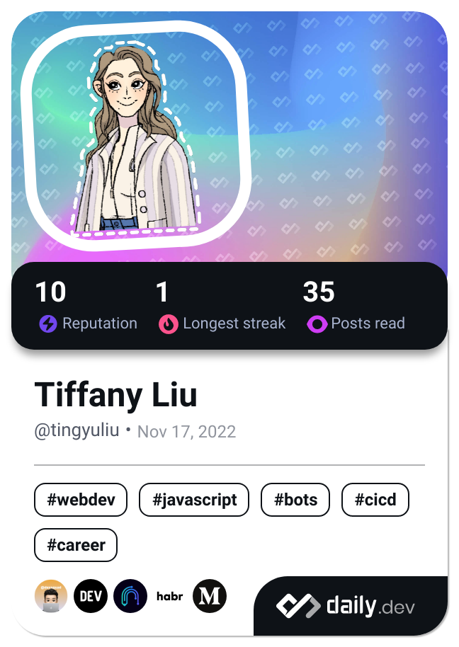

### Hi there 👋 I'm Tingyu (Tiffany). 
A girl is passionate about coding, eager to learn new technologies and loves a good challenge. 💻

I believe in the power of technology to change the world, and I'm constantly striving to grow and improve to make that belief a reality.

Let's connect and explore, learn, and create together! 🚀

<!--
**tinyuliu/tinyuliu** is a ✨ _special_ ✨ repository because its `README.md` (this file) appears on your GitHub profile.

Here are some ideas to get you started:

- 🔭 I’m currently working on ...
- 🌱 I’m currently learning ...
- 👯 I’m looking to collaborate on ...
- 🤔 I’m looking for help with ...
- 💬 Ask me about ...
- 📫 How to reach me: ...
- 😄 Pronouns: ...
- ⚡ Fun fact: ...
-->
